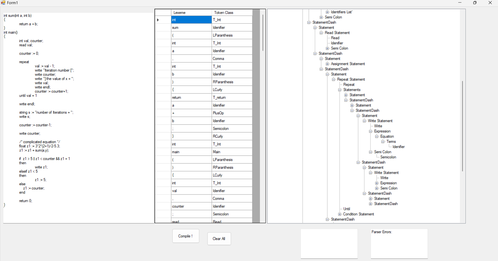
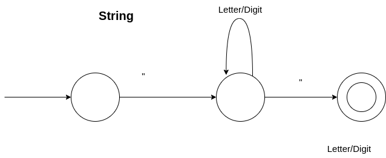
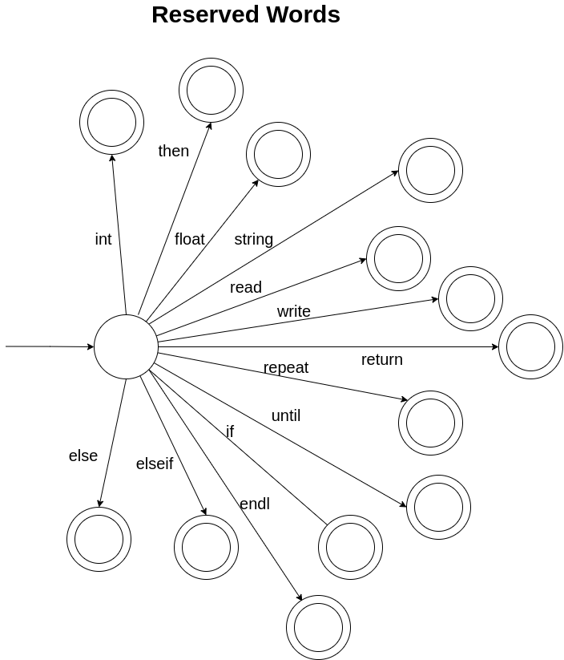
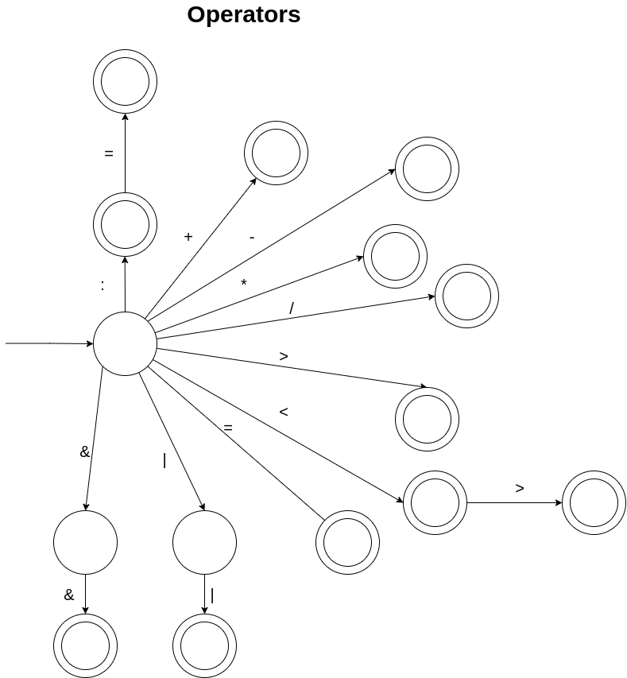
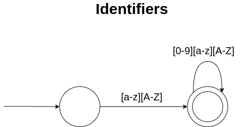
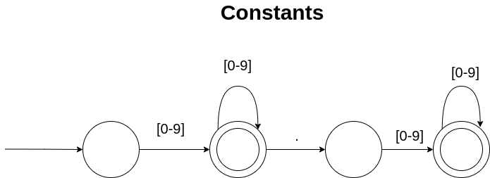
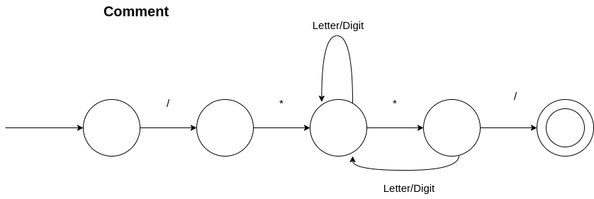

# [Tiny Programming Language Compiler](https://a7medayman6.github.io/Tiny-Compiler/)


## TINY Programming Language

> A program in TINY consists of a set of functions (any number of functions and ends with a main function), each function is a sequence of statements including (declaration, assignment, write, read, if, repeat, function, comment, …) each statement consists of (number, string, identifier, expression, condition, …).



## TINY Language Regular Expressions

digit ::= 0\|1\|2\|3\|4......\|9

letter ::= [a-z][A-Z]

Number ::= digit*.?digit*

String ::= "(letter\|digit)*"

Reserved_Keywords ::=  int \| float \| string \| read \| write \|
repeat \| until \| if \| elseif \| else \| then \| return \| endl

Comment ::= /\*String\*\/

Identifier ::= letter (letter \| digit)*

Term ::= Number \| Identifier \| Function_Call

Arithmatic_Operator ::= + \| - \| * \| /

Equation ::=  (Term (Arithmatic_Operator (Equation \| Term))+) \| (\( Term Arithmatic_Operator ( Equation \| Term) \)) (Arithmatic_Operator (Term \| Equation))*

Expression ::= String \| Term \| Equation

Datatype ::= int \| float \| string

Condition_Operator ::= < \| > \| = \| <>

Boolean_Operator ::= && \| \\|\\|


______________________________________________

## TINY Language Deterministic Finite Automaton DFA

- Strings



- Reserved Words



- Operators



- Identifiers



- Constants



- Comments




______________________________________________

## TINY Language Context Free Grammar CFG

- Program → Program_Function_Statement Main_Function

- Main_Function → Data_Type main ( ) Function_Body

- Program_Function_Statement → Function_Statement Program_Function_Statement \| ɛ

  - Function_Statement → Function_Declaration Function_Body

  - Function_Declaration → Data_Type Function_Name ( Function_Parameters )

  - Datatype → int \| float \| string

  - Function_Name → identifier

  - Function_Parameters → Data_Type Identifier More_Parameters \| ɛ

  - More_Function_Parameters → , Data_Type Identifier More_Function_Parameters \| ɛ

  - Function_Body → { Statements Return_Statement }

- Statements → State Statements \| ɛ

  - Statement → Function_Call \| Assignment_Statement \| Declaration_Statement \| Write_Statement \| Read_Statement \| If_Statement \| Repeat_Statement

- Function_Call → Identifier ( Parameters) ;

  - Parameters → Expression More_Parameters \| ɛ
  - More_Parameters → , Expression More_Parameters \| ɛ

- Assignment_Statement → Identifier := Expression

- Expression → String \| Term \| Equation

- Term → number \| identifier \| Function_Call

- Equation → Term Operator_Equation \| (Equation) Operator_Equation 

- Operator_Equation → Arthematic_Operator Equation Operator_Equation \| ε

	- Arthematic_Operator → plus \| minus \| divide \| multiply 

- Declaration_Statement → Data_Type Identifier Declare_Rest1 Declare_Rest2 ;

  - Declare_Rest1 → , identifier Declare_Rest1 \| ɛ

  - Declare_Rest2 → Assignment_Statement \| ɛ

- Write_Statement → write Write_Rest ;

  - Write_Rest → Expression \| endl

- Read_Statement → read identifier ;

- If_Statement → if Condition_Statement then Statements Other_Conditions

  - Condition_statement → Condition

  - Condition → identifier Condition_Operator Term More_Conditions

  - Condition_Operator → less_than \| greater_than \| not_equal \| equal

  - More_Conditions → and Condition \| or Condition\| ɛ

  - Other_Conditions → Else_if_Statement \| Else_statement \| end


- Else_if_Statement → elseif Condition_statement then Statements Other_Conditions

- Else_statement → else Statements end

- Repeat_Statement → repeat Statements untill Condition_statement

- Return_Statement → return Expression ;

______________________________________________

## TINY Code Samples

### Sample program includes all 30 rules

```cpp
int sum(int a, int b)
{
	return a + b;
}
int main()
{
	int val, counter;
	read val;

	counter := 0;

	repeat                                                                                
		val := val - 1;
		write "Iteration number [";
		write counter;
		write "] the value of x = ";
		write val;
		write endl;                          
		counter := counter+1;                                                      
	until val = 1

	write endl;

	string s := "number of Iterations = ";
	write s; 

	counter := counter-1;

	write counter;

	/* complicated equation */    
	float z1 := 3*2*(2+1)/2-5.3;
	z1 := z1 + sum(a,y);

	if  z1 > 5 || z1 < counter && z1 = 1 
	then 
		write z1;
	elseif z1 < 5 
	then
		z1 := 5;
	else
	    z1 := counter;
	end

	return 0;
}

```

### Sample program in Tiny language – computes factorial

```cpp
/* Sample program in Tiny language – computes factorial*/
int main()
{
	int x;
	read x; /*input an integer*/
	if x > 0 /*don’t compute if x <= 0 */
	then 
		int fact := 1;

		repeat
			fact := fact * x;
			x := x – 1;
		until x = 0

		write fact; /*output factorial of x*/
	end
	return 0;
}
```

